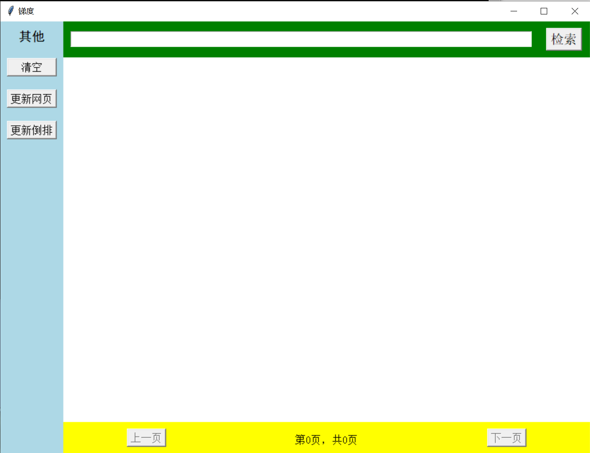
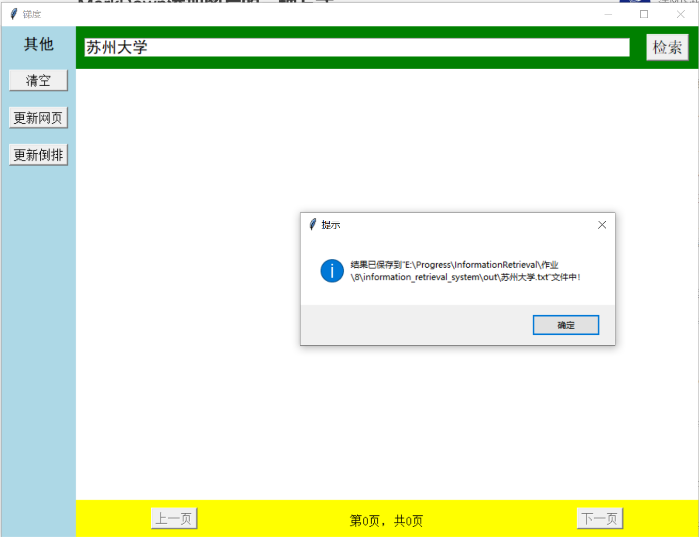
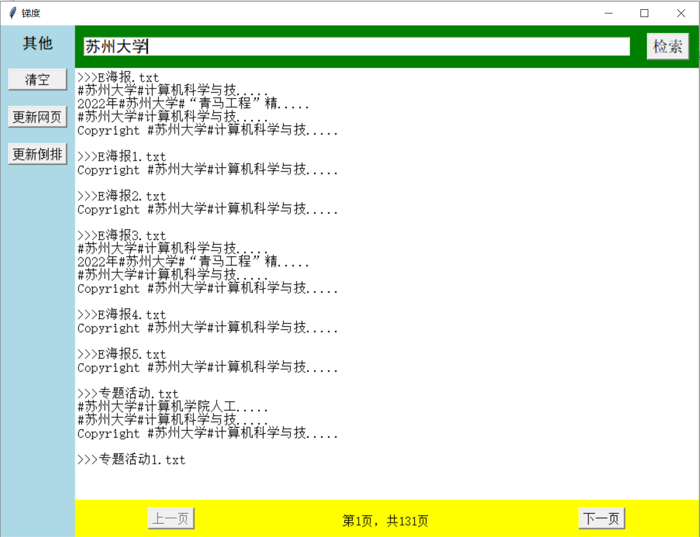
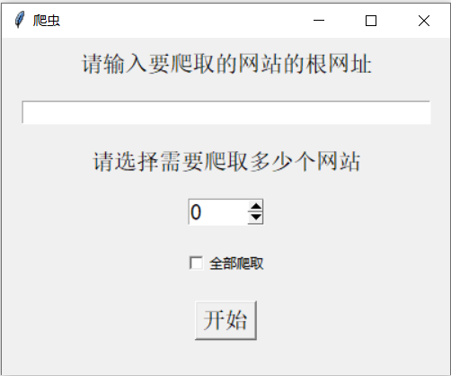
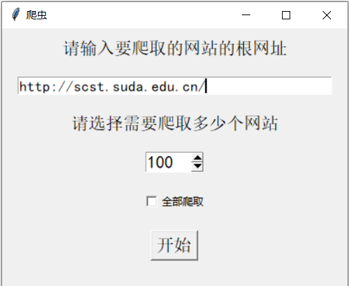
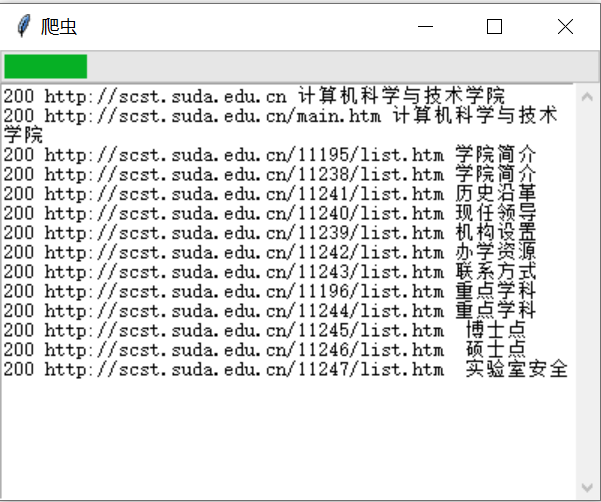
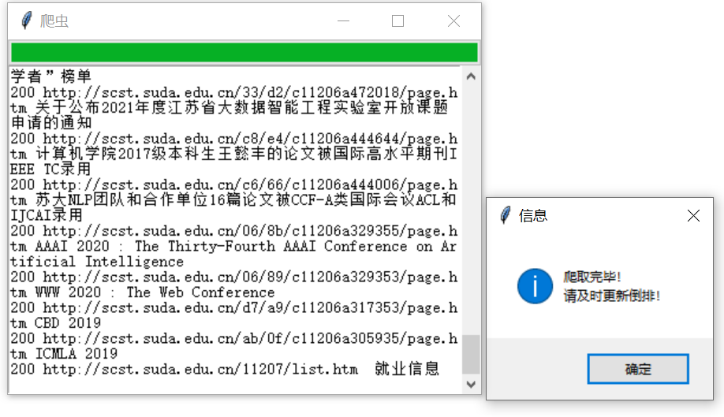

# 8.简易信息检索系统

2127405068 孙家扬

----

## 作业要求

编写一个爬虫模块，尽量爬取一个机构对应的所有静态网页，保存到磁盘中。基于爬取的网页，根据已学知识，搭建一个完整的信息检索系统

## 附件文件结构
* ```explanation```  说明文件所需图片
* ```informational_retrieval_system```
  * ```out```  *查询结果输出文件夹*
  * ```utils```
    * ```stopwords-master```  停用词词典文件夹
    * ```htmls```  存放爬取到的html文件的文件夹
    * ```websites```  存放提取到的网页正文的文件夹
    * ```dict.txt.big.txt```  分词词典
    * ```index.json```  *倒排索引*
    * ```__init__.py```
    * ```bool_query.py```  **布尔查询模块**
    * ```invert_index.py```  **倒排索引模块**
    * ```tf_idf.py```  **网页排序模块**
    * ```web_extract.py```  **网页提取模块**
    * ```word_cut.py```  **分词模块**
    * ```fonts.py```  中文字体选择辅助模块
  * ```__init__.py```
  * ```creeper.py```  **爬虫模块**
  * ```ui.py```  **用户操作界面（查询模块）**
  * ```main.py```  **程序主入口**
* ```requirements.txt```  第三方依赖库列表
* ```install_requirements.bat```  第三方依赖安装辅助程序
* ```readme.md```

## 运行要求及方法

### 要求

运行前请确保上述文件结构保持完整。请使用Python3.9及以上版本运行本程序，同时请确保环境中安装有```beautifulsoup4, pypinyin, requests```这三个第三方库。如果未安装，可以参考```requirements.txt```中列出的版本进行手动安装，或者也可以直接运行```install_requirements.bat```批处理文件进行批量安装。

### 方法
双击```main.py```即可运行本程序。

```utils/htmls```和```utils/websites```文件夹中原始会存放有已经爬取好的苏大计算机科学与技术学院官网的静态网页文件用于测试。你可以直接对这它们进行检索，也可以将它们删除并重新爬取新的网页进行检索。

### UI界面说明

UI界面截图：



在绿色框中的文本框里输入需要检索的语句，点击“检索”，检索所得的结果将显示于白色界面中。检索所得结果将保存于提示所指路径中。





黄色框中显示有当前页数以及总页数，点击“上一页”/“下一页”可以翻页。

点击蓝色框中的清空按钮可以清除当前检索的内容

更新网页界面截图：



该界面用于更新检索用网站，在文本框中输入需要爬取的网站的根网址，输入需要爬取的网站数量，点击“开始”，就可以开始爬取该网址
相应个数的静态网页（.html或.htm）





也可以勾选下方的全部爬取，爬取该网站下所有的静态子网页。




更新完网页或者手动改动过网页文件后，请点击“更新倒排”按钮及时更新倒排。

*注意：更新倒排需要花费一些时间，这段时间里面程序有可能未响应，这是正常现象，请不要关闭程序，耐心等待倒排更新完毕。*